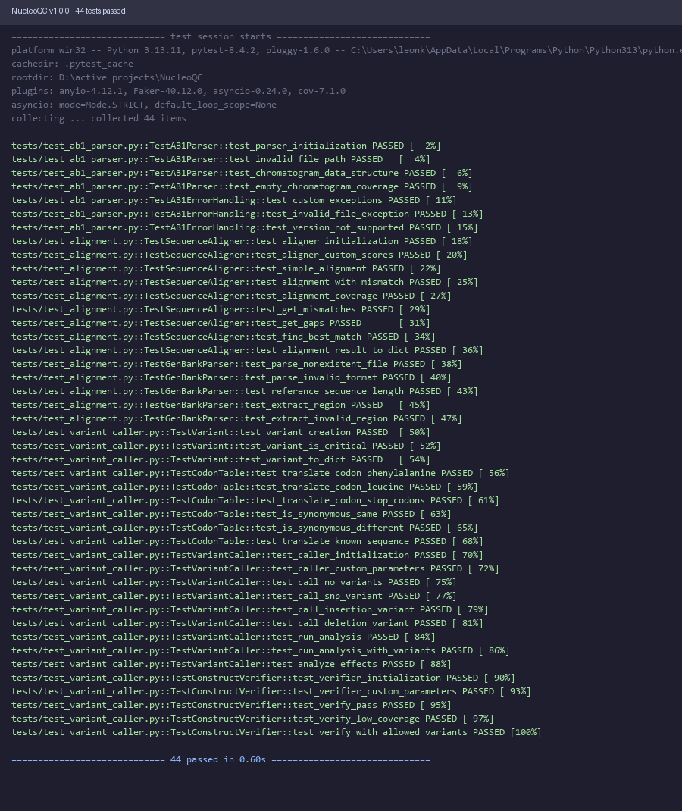

# NucleoQC

**Open-Source Biologics Quality Control Suite**

NucleoQC is a desktop application for Sanger sequencing analysis and variant detection in biopharmaceutical manufacturing. Designed for the Indian pharmaceutical industry, it provides an affordable, offline alternative to expensive Western software like SnapGene, Geneious, and Benchling.

## Features

- **AB1 File Parsing**: Read and parse Sanger sequencing files (.ab1 format)
- **Reference Sequence Alignment**: Align sequencing reads against GenBank reference sequences
- **Variant Calling**: Automatically detect SNPs, insertions, and deletions
- **Effect Analysis**: Classify variants as synonymous, missense, nonsense, or frameshift
- **QC Verification**: Automated construct verification with configurable thresholds
- **Regulatory Reports**: Generate ISO-compliant PDF reports for FDA/CDSCO submission
- **Audit Trail**: SQLite-based audit logging with data integrity verification
- **Offline Operation**: Fully offline operation for air-gapped manufacturing environments

## Demo



## Installation

### Prerequisites

- Python 3.9 or higher
- Windows 10+ or Linux
- 4GB RAM minimum (8GB recommended)

### Install from Source

```bash
# Clone the repository
git clone https://github.com/nucleoqc/nucleoqc.git
cd nucleoqc

# Create virtual environment
python -m venv venv
source venv/bin/activate  # On Windows: venv\Scripts\activate

# Install dependencies
pip install -r requirements.txt

# Install NucleoQC
pip install -e .

# Run the application
nucleoqc
```

### Install Dependencies Only

```bash
pip install -r requirements.txt
python main.py
```

## Usage

### Quick Start

1. Launch NucleoQC from the application menu or run `nucleoqc`
2. Load a GenBank reference file (File > Load Reference)
3. Load one or more AB1 sequencing files (File > Load AB1 Files)
4. Enter operator name and sample ID
5. Click "Run Analysis" to process the samples
6. Review results in the table
7. Generate a PDF report (File > Generate Report)

### Command Line Interface

```bash
# Analyze AB1 files against a reference
nucleoqc --reference reference.gb --ab1 sample1.ab1 sample2.ab1 --output report.pdf

# Export audit log
nucleoqc --export-audit audit_log.json
```

## Project Structure

```
NucleoQC/
├── src/
│   ├── __init__.py          # Package initialization
│   ├── ab1_parser.py        # AB1 file parsing
│   ├── alignment.py         # Sequence alignment algorithms
│   ├── variant_caller.py    # Variant detection and analysis
│   ├── report_generator.py  # PDF report generation
│   └── audit_db.py          # SQLite audit trail
├── gui/
│   ├── __init__.py
│   └── main_window.py       # Main application window
├── tests/
│   ├── __init__.py
│   ├── test_ab1_parser.py
│   ├── test_alignment.py
│   └── test_variant_caller.py
├── main.py                  # Entry point
├── setup.py                 # Package setup
├── requirements.txt         # Dependencies
└── README.md                # This file
```

## API Usage

### Parsing AB1 Files

```python
from src.ab1_parser import AB1Parser

parser = AB1Parser("sample.ab1")
chromatogram, metadata = parser.parse()

print(f"Sequence: {chromatogram.sequence}")
print(f"Quality: {chromatogram.get_average_quality()}")
print(f"Sample: {metadata.sample_name}")
```

### Alignment and Variant Calling

```python
from src.alignment import GenBankParser, SequenceAligner
from src.variant_caller import VariantCaller, ConstructVerifier

# Load reference
ref_data = GenBankParser.parse("reference.gb")

# Align sequences
aligner = SequenceAligner()
result = aligner.align("ATCG...", ref_data.sequence)

# Call variants
caller = VariantCaller()
variant_result = caller.run_analysis(
    result.aligned_query,
    result.aligned_target,
    ref_sequence=ref_data.sequence
)

# Verify construct
verifier = ConstructVerifier()
verification = verifier.verify(variant_result)
print(f"Status: {verification['status']}")
```

### Generating Reports

```python
from src.report_generator import ReportGenerator, ReportData
from src.audit_db import AuditDatabase
import datetime

# Create report data
data = ReportData(
    sample_name="Sample001",
    sample_id="SPL-2024-001",
    reference_name="Plasmid XYZ",
    reference_id="NC_012345",
    analysis_date=datetime.date.today().isoformat(),
    analysis_time=datetime.datetime.now().strftime("%H:%M:%S"),
    operator_name="Dr. Scientist",
    software_version="1.0.0",
    overall_status="PASS",
    coverage_percentage=99.5,
    total_variants=0,
    critical_variants=0,
    variants=[],
    effects=[]
)

# Generate PDF
generator = ReportGenerator()
output_path = generator.generate_report(data, "QC_Report_Sample001.pdf")

# Log to audit trail
db = AuditDatabase()
db.log_analysis(
    sample_name=data.sample_name,
    sample_id=data.sample_id,
    reference_name=data.reference_name,
    reference_id=data.reference_id,
    operator_name=data.operator_name,
    overall_status=data.overall_status,
    coverage_percentage=data.coverage_percentage,
    total_variants=data.total_variants,
    critical_variants=data.critical_variants,
    variants=data.variants,
    effects=data.effects,
    report_path=output_path
)
```

## Testing

```bash
# Run all tests
pytest tests/

# Run with coverage
pytest --cov=src tests/

# Run specific test file
pytest tests/test_ab1_parser.py
```

## Contributing

1. Fork the repository
2. Create a feature branch (`git checkout -b feature/amazing-feature`)
3. Commit your changes (`git commit -m 'Add amazing feature'`)
4. Push to the branch (`git push origin feature/amazing-feature`)
5. Open a Pull Request

## License

This project is licensed under the MIT License - see the [LICENSE](LICENSE) file for details.

## Support

- **Documentation**: [https://nucleoqc.readthedocs.io/](https://nucleoqc.readthedocs.io/)
- **Issues**: [https://github.com/nucleoqc/nucleoqc/issues](https://github.com/nucleoqc/nucleoqc/issues)
- **Discussions**: [https://github.com/nucleoqc/nucleoqc/discussions](https://github.com/nucleoqc/nucleoqc/discussions)

## Acknowledgments

- Biopython for sequence analysis utilities
- ReportLab for PDF generation
- PyQt6 for the graphical user interface
- The Indian pharmaceutical community for inspiring this project

---

**NucleoQC** - Making Indian manufacturing Atmanirbhar (self-reliant)
